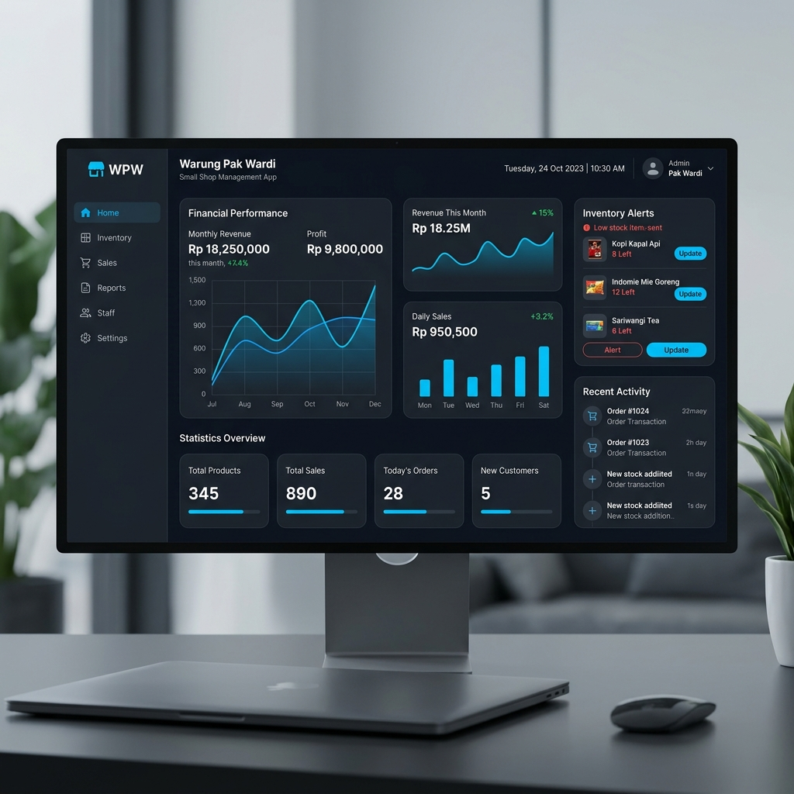

# 🏪 Warung Digital - Shop Management System



**Warung Digital** adalah aplikasi manajemen toko dan kasir (Point of Sale) modern yang dibangun menggunakan Flutter. Aplikasi ini dirancang untuk mendigitalisasi operasional warung kecil, memberikan kemudahan dalam pencatatan stok, manajemen transaksi, hingga analisis keuntungan secara mendalam dan otomatis.

---

## 🚀 Fitur Utama Berdasarkan Modul

Aplikasi ini dibagi menjadi beberapa modul utama yang mewakili setiap layar (screen) fungsional di dalam aplikasi:

### 🏠 1. Dashboard Utama (`HomeScreen`)
Pusat kontrol informasi toko Anda.
- **Kartu Metrik (Hero)**: Pantau total Pendapatan (Omzet), Keuntungan (Laba), jumlah Transaksi, dan total barang Terjual dalam satu layar.
- **Menu Akses Cepat**: Navigasi instan untuk menambah transaksi baru atau mengelola inventaris.
- **Peringatan Stok Rendah**: Bagian khusus yang otomatis menampilkan produk dengan stok menipis agar Anda bisa segera melakukan *re-stock*.

### 🛒 2. Modul Transaksi & Kasir
Sistem kasir yang simpel namun bertenaga.
- **Tambah Transaksi (`TransactionAddScreen`)**: Pilih produk dengan antarmuka pencarian cepat, kelola jumlah item di keranjang, dan proses checkout secara real-time.
- **Riwayat Penjualan (`TransactionListScreen`)**: Pantau semua transaksi yang pernah dilakukan, lengkap dengan filter pencatatan waktu.
- **Rincian Transaksi (`TransactionDetailScreen`)**: Lihat detail barang yang terjual dalam satu nota transaksi spesifik.
- **Pembuat Struk (`ReceiptGeneratorPage`)**: Menghasilkan struk belanja digital profesional dalam format PDF yang siap dicetak atau dibagikan.

### 📦 3. Modul Manajemen Inventaris
Kelola stok barang dagangan Anda dengan rincian yang akurat.
- **Katalog Produk (`ProductListScreen`)**: Daftar seluruh barang yang tersedia beserta informasi stok dan harganya.
- **Manajemen Produk (`ProductAdd` & `ProductEdit`)**: Tambah produk baru dengan foto, atur Harga Pokok Penjualan (HPP) untuk perhitungan profit otomatis, serta perbarui informasi stok kapan saja.

### 📈 4. Laporan & Analitik Keuangan
Dapatkan wawasan bisnis berbasis data.
- **Statistik Laporan (`ReportScreen`)**:
    - Filter data berdasarkan rentang tanggal yang diinginkan.
    - **Visualisasi Grafik**: Tren pendapatan harian (Area Chart) dan Top 5 Produk terlaris (Bar Chart).
    - **Tabel Rincian**: Tabel detail yang merinci profit per produk.
    - **Ekspor Excel**: Unduh laporan keuangan lengkap ke dalam format file Excel (.xlsx) untuk pembukuan eksternal.

### ⚙️ 5. Pengaturan Aplikasi
Personalisasi pengalaman aplikasi.
- **Setelan (`SettingsScreen`)**: Kelola preferensi aplikasi dan informasi profil toko.

---

## 🛠️ Tech Stack & Arsitektur

- **Frontend**: Flutter (Dart)
- **State Management**: flutter_bloc (BLoC Pattern)
- **Local Persistence**: SQLite (sqflite) - Data tersimpan aman di perangkat secara offline.
- **Chart Engine**: Syncfusion Flutter Charts
- **Excel Handling**: Excel package
- **UI Components**: Custom reusable widgets dengan desain modern (Glassmorphism & Dark Mode support).

---

## 🏁 Memulai (Setup Guide)

1. **Prasyarat**:
    - Pastikan Flutter SDK sudah terpasang di komputer Anda.
    - Gunakan Android Studio atau VS Code sebagai IDE.

2. **Instalasi**:
    ```bash
    git clone https://github.com/dimassfeb-09/warungpakwardi.git
    cd warungpakwardi
    flutter pub get
    ```

3. **Menjalankan Aplikasi**:
    ```bash
    flutter run
    ```

---

*Warung Digital - "Solusi Digital, Rezeki Makin Maksimal."*
